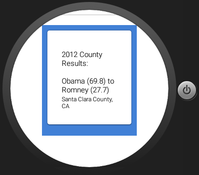
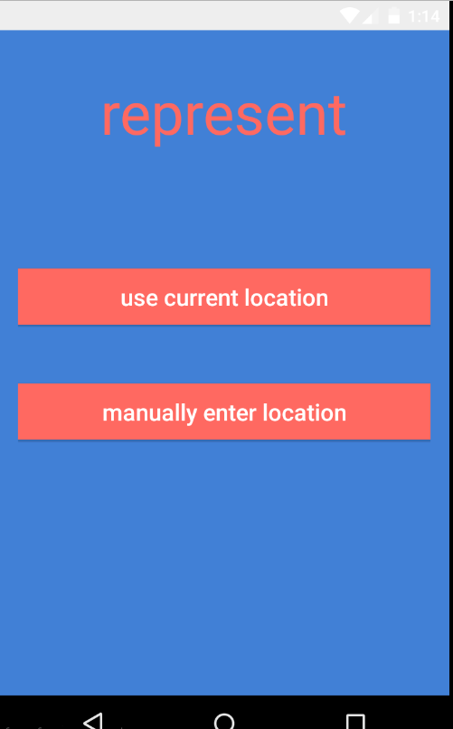

# PROG 02: Represent!

Represent is a political smart watch and phone app that lets you see congress people that represent either A) your current location B) a manual location of your choosing or C) a random location.

## Authors

FirstName LastName (arman@berkeley.edu](mailto:your_email@berkeley.edu))

## Demo Video

See [2 C] (https://www.youtube.com/watch?v=hzDOn9RgdRk&feature=youtu.be)

## Screenshots

## Acknowledgments

* Hat tip to anyone who's code was used
* Any other support
